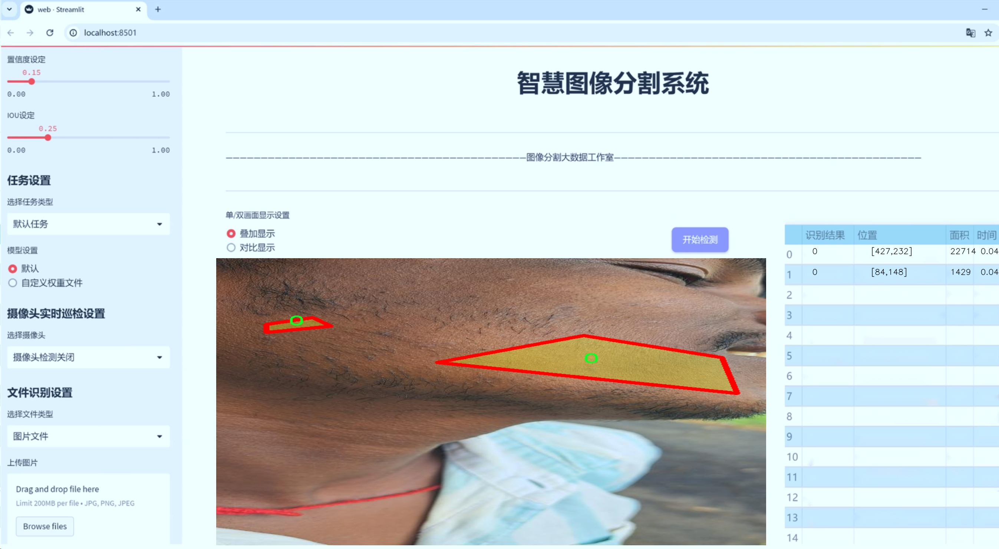
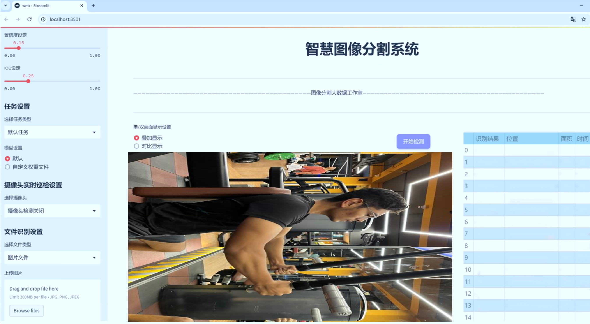
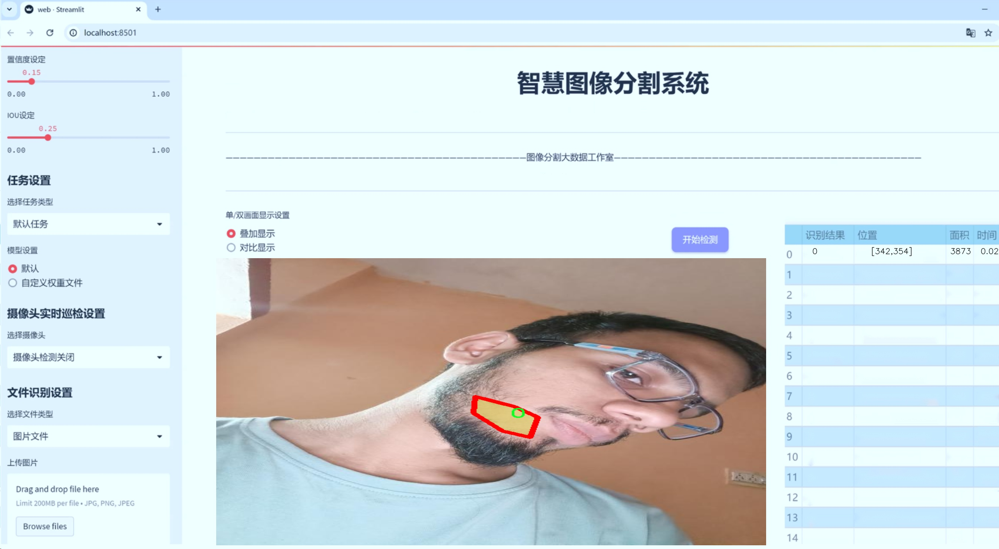
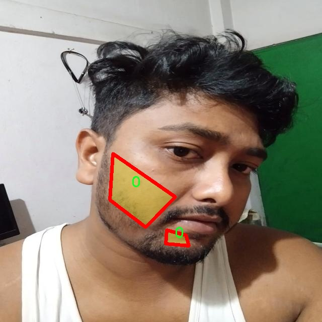
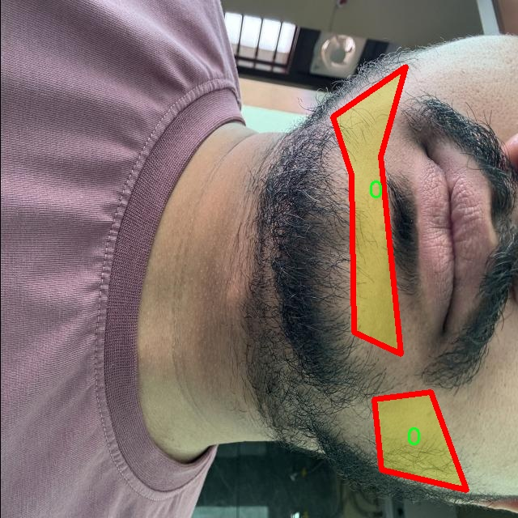
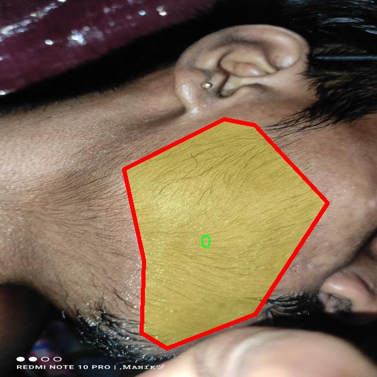
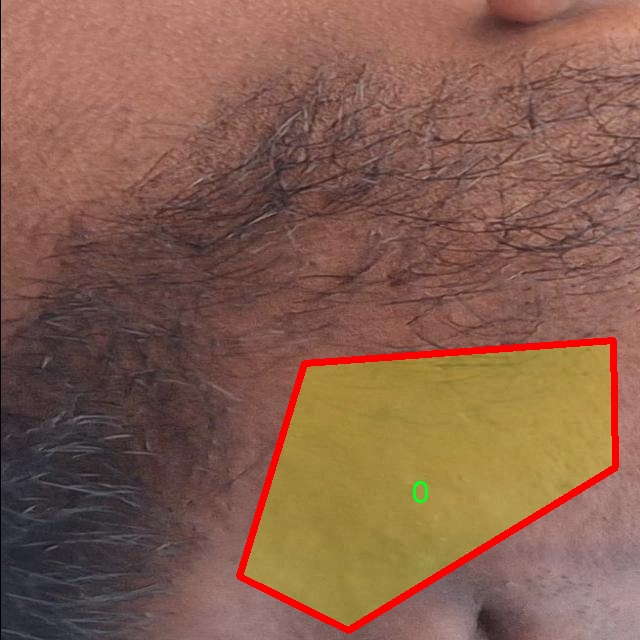
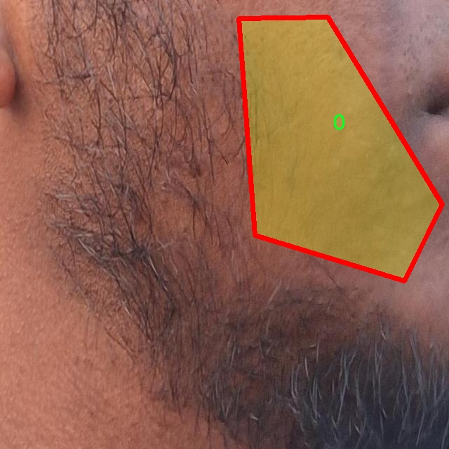

# 胡须图像分割系统源码＆数据集分享
 [yolov8-seg-act＆yolov8-seg-C2f-Parc等50+全套改进创新点发刊_一键训练教程_Web前端展示]

### 1.研究背景与意义

项目参考[ILSVRC ImageNet Large Scale Visual Recognition Challenge](https://gitee.com/YOLOv8_YOLOv11_Segmentation_Studio/projects)

项目来源[AAAI Global Al lnnovation Contest](https://kdocs.cn/l/cszuIiCKVNis)

研究背景与意义

随着计算机视觉技术的快速发展，图像分割作为其中一个重要的研究方向，逐渐在多个领域中展现出其广泛的应用潜力。尤其是在医学影像分析、自动驾驶、安防监控等领域，图像分割技术的进步为相关研究提供了强有力的支持。近年来，基于深度学习的图像分割方法，尤其是YOLO（You Only Look Once）系列模型，因其高效性和准确性而受到广泛关注。YOLOv8作为该系列的最新版本，进一步提升了目标检测和分割的性能，展现出更强的实时处理能力和更高的分割精度。

在此背景下，针对胡须图像的分割研究具有重要的学术价值和实际意义。胡须作为人类面部特征的一部分，其形态和样式的多样性使得胡须图像分割成为一项具有挑战性的任务。传统的图像处理方法在处理复杂的胡须图像时，往往难以有效提取出胡须的细节特征，导致分割效果不理想。而基于YOLOv8的改进方法，能够通过深度学习模型对胡须图像进行更为精准的特征提取和分割，进而提升分割效果。

本研究所使用的数据集包含1900张胡须图像，分为两个类别，其中一个类别为“patches”。这一数据集的构建为胡须图像分割提供了丰富的样本基础，使得模型能够在多样化的胡须形态和背景下进行训练和测试。通过对该数据集的深入分析与处理，能够为模型的训练提供有效的指导，进而提高模型的泛化能力和适应性。此外，数据集中包含的“patches”类别，能够帮助模型更好地理解胡须的细节特征，提升分割的精度。

本研究的意义不仅在于推动胡须图像分割技术的发展，更在于为相关领域的应用提供新的思路和方法。例如，在美容行业，基于该分割系统的应用可以实现自动化的胡须修剪建议，提高用户体验；在虚拟现实和增强现实技术中，精准的胡须分割能够提升虚拟形象的真实感；在生物识别领域，胡须的特征可以作为身份识别的一部分，进一步提高识别的准确性。

综上所述，基于改进YOLOv8的胡须图像分割系统的研究，不仅具有重要的理论价值，也具备广泛的应用前景。通过对胡须图像的深入分析与分割研究，能够为计算机视觉领域的进一步发展提供新的思路，同时推动相关行业的技术进步与创新。

### 2.图片演示







##### 注意：由于此博客编辑较早，上面“2.图片演示”和“3.视频演示”展示的系统图片或者视频可能为老版本，新版本在老版本的基础上升级如下：（实际效果以升级的新版本为准）

  （1）适配了YOLOV8的“目标检测”模型和“实例分割”模型，通过加载相应的权重（.pt）文件即可自适应加载模型。

  （2）支持“图片识别”、“视频识别”、“摄像头实时识别”三种识别模式。

  （3）支持“图片识别”、“视频识别”、“摄像头实时识别”三种识别结果保存导出，解决手动导出（容易卡顿出现爆内存）存在的问题，识别完自动保存结果并导出到tempDir中。

  （4）支持Web前端系统中的标题、背景图等自定义修改，后面提供修改教程。

  另外本项目提供训练的数据集和训练教程,暂不提供权重文件（best.pt）,需要您按照教程进行训练后实现图片演示和Web前端界面演示的效果。

### 3.视频演示

[3.1 视频演示](https://www.bilibili.com/video/BV1m7DdYiEQ9/)

### 4.数据集信息展示

##### 4.1 本项目数据集详细数据（类别数＆类别名）

nc: 1
names: ['0']


##### 4.2 本项目数据集信息介绍

数据集信息展示

在本研究中，我们采用了名为“beard_Segmentor”的数据集，以支持对胡须图像分割系统的训练，旨在改进YOLOv8-seg模型的性能。该数据集专门针对胡须图像的分割任务而设计，具有独特的特征和结构，能够有效地为模型提供丰富的训练样本和标注信息。数据集的类别数量为1，具体类别列表中仅包含一个类别，标记为“0”。这一简单而明确的类别设置使得数据集在处理胡须图像时，能够专注于该特定对象的特征提取与分割，避免了多类别之间的干扰，从而提高了模型的学习效率和分割精度。

“beard_Segmentor”数据集包含了大量的胡须图像，这些图像经过精心挑选和标注，确保了其在多样性和代表性方面的优势。数据集中涵盖了不同种类、不同形状和不同颜色的胡须图像，反映了真实世界中胡须的多样性。这种多样性不仅有助于模型在训练过程中学习到更为广泛的特征，还能增强模型在实际应用中的鲁棒性，使其能够在各种复杂场景下进行有效的胡须分割。

在数据集的构建过程中，研究团队采用了先进的图像标注技术，确保每一张图像中的胡须部分都得到了准确的标注。这一过程不仅提高了数据集的质量，也为后续的模型训练提供了可靠的基础。通过高质量的标注，YOLOv8-seg模型能够在训练过程中更好地理解胡须的形状、边缘和纹理特征，从而实现更为精确的分割效果。

此外，数据集的设计还考虑到了不同光照条件和背景环境对胡须图像分割的影响。数据集中包含了在不同光照条件下拍摄的胡须图像，确保模型能够适应各种光照变化带来的挑战。同时，数据集中的图像背景也各具特色，既有简单的单色背景，也有复杂的多色背景，这种多样化的背景设置能够帮助模型学习到如何在不同环境中进行有效的分割。

在数据预处理阶段，研究团队对图像进行了标准化处理，以确保输入数据的一致性和稳定性。这一过程包括图像的缩放、裁剪和归一化等操作，使得每一张输入图像都能够适应YOLOv8-seg模型的输入要求。此外，数据集还进行了数据增强处理，通过旋转、翻转、添加噪声等方式，进一步扩展了训练样本的数量和多样性，提升了模型的泛化能力。

综上所述，“beard_Segmentor”数据集为改进YOLOv8-seg的胡须图像分割系统提供了坚实的基础。通过精心设计的标注、丰富的样本多样性以及有效的数据预处理和增强策略，该数据集不仅能够提升模型的训练效果，还能为后续的实际应用提供强有力的支持。随着研究的深入，我们期待该数据集能够在胡须图像分割领域发挥重要作用，为相关技术的发展贡献力量。











### 5.全套项目环境部署视频教程（零基础手把手教学）

[5.1 环境部署教程链接（零基础手把手教学）](https://www.bilibili.com/video/BV1jG4Ve4E9t/?vd_source=bc9aec86d164b67a7004b996143742dc)


[5.2 安装Python虚拟环境创建和依赖库安装视频教程链接（零基础手把手教学）](https://www.bilibili.com/video/BV1nA4VeYEze/?vd_source=bc9aec86d164b67a7004b996143742dc)

### 6.手把手YOLOV8-seg训练视频教程（零基础小白有手就能学会）

[6.1 手把手YOLOV8-seg训练视频教程（零基础小白有手就能学会）](https://www.bilibili.com/video/BV1cA4VeYETe/?vd_source=bc9aec86d164b67a7004b996143742dc)


按照上面的训练视频教程链接加载项目提供的数据集，运行train.py即可开始训练



     Epoch   gpu_mem       box       obj       cls    labels  img_size
     1/200     0G   0.01576   0.01955  0.007536        22      1280: 100%|██████████| 849/849 [14:42<00:00,  1.04s/it]
               Class     Images     Labels          P          R     mAP@.5 mAP@.5:.95: 100%|██████████| 213/213 [01:14<00:00,  2.87it/s]
                 all       3395      17314      0.994      0.957      0.0957      0.0843

     Epoch   gpu_mem       box       obj       cls    labels  img_size
     2/200     0G   0.01578   0.01923  0.007006        22      1280: 100%|██████████| 849/849 [14:44<00:00,  1.04s/it]
               Class     Images     Labels          P          R     mAP@.5 mAP@.5:.95: 100%|██████████| 213/213 [01:12<00:00,  2.95it/s]
                 all       3395      17314      0.996      0.956      0.0957      0.0845

     Epoch   gpu_mem       box       obj       cls    labels  img_size
     3/200     0G   0.01561    0.0191  0.006895        27      1280: 100%|██████████| 849/849 [10:56<00:00,  1.29it/s]
               Class     Images     Labels          P          R     mAP@.5 mAP@.5:.95: 100%|███████   | 187/213 [00:52<00:00,  4.04it/s]
                 all       3395      17314      0.996      0.957      0.0957      0.0845


### 7.50+种全套YOLOV8-seg创新点代码加载调参视频教程（一键加载写好的改进模型的配置文件）

[7.1 50+种全套YOLOV8-seg创新点代码加载调参视频教程（一键加载写好的改进模型的配置文件）](https://www.bilibili.com/video/BV1Hw4VePEXv/?vd_source=bc9aec86d164b67a7004b996143742dc)

### 8.YOLOV8-seg图像分割算法原理

原始YOLOV8-seg算法原理

YOLOV8-seg算法是YOLO系列中的一项重要创新，旨在将目标检测与语义分割相结合，进一步提升计算机视觉任务的精度和效率。作为YOLO系列的最新版本，YOLOV8-seg在保持实时检测速度的同时，增强了对图像中物体的分割能力，使其在复杂场景下的应用更加广泛。

YOLOV8-seg算法的核心架构依然基于YOLO的传统设计理念，分为输入端、主干网络和检测端三个主要部分。输入端负责接收图像数据并进行预处理，以适应后续的特征提取和目标检测任务。主干网络则是算法的核心部分，负责从输入图像中提取多层次的特征信息。YOLOV8-seg在主干网络中引入了C2f模块，这一模块在设计上借鉴了YOLOv5中的C3模块和YOLOv7中的ELAN模块，通过增加残差连接来增强特征的传递和梯度的流动，从而在保持轻量化的同时提升了特征提取的能力。

在特征融合层，YOLOV8-seg采用了特征金字塔网络（FPN）与路径聚合网络（PAN）的结合，进一步提升了对不同尺度特征的提取能力。通过引入BiFPN网络，YOLOV8-seg能够实现高效的双向跨尺度连接与加权特征融合，确保在多尺度特征的提取上具备更高的灵活性和准确性。这种设计使得算法在处理复杂场景时，能够更好地识别和分割出不同的物体。

检测端的设计是YOLOV8-seg的一大亮点。与传统的耦合头结构不同，YOLOV8-seg采用了解耦合头结构，将分类和检测任务分开处理。这种结构的优势在于可以针对不同任务优化各自的网络参数，提高了整体的检测精度。此外，YOLOV8-seg摒弃了传统的Anchor-Based方法，转而采用Anchor-Free的策略，这一变化使得模型在处理不同形状和尺寸的物体时更加灵活。

在训练过程中，YOLOV8-seg引入了动态Task-Aligned Assigner样本分配策略，旨在提高模型对不同任务的适应性。同时，在数据增强方面，算法在训练的最后10个epoch中关闭了马赛克增强，这一策略有助于模型在接近收敛时更好地稳定学习，从而提升最终的检测效果。损失函数的设计上，YOLOV8-seg采用了BCELoss作为分类损失，同时结合DFLLoss和CIoULoss作为回归损失，这种多损失函数的组合进一步提升了模型的学习能力。

YOLOV8-seg的轻量化设计使其在实时应用中表现出色。相较于之前的YOLO版本，YOLOV8-seg在网络结构上进行了优化，尤其是在主干特征提取网络层，使用了更轻量化的C2F模块替代了原有的C3模块。这一变化不仅减少了计算量，还提升了特征提取的效率，使得YOLOV8-seg能够在资源受限的环境中依然保持高效的性能。

YOLOV8-seg的应用前景广泛，尤其在农业、自动驾驶、安防监控等领域展现出巨大的潜力。例如，在苹果采摘的场景中，YOLOV8-seg能够快速识别和定位苹果，结合路径规划算法，使得自动采摘机器人能够高效完成采摘任务。这种结合不仅提高了农业生产的效率，也为智能农业的发展提供了新的思路。

总的来说，YOLOV8-seg算法通过对传统YOLO架构的创新与优化，成功实现了目标检测与语义分割的有机结合，展现出高效、准确的特性。其轻量化设计和灵活的网络结构使得YOLOV8-seg在各种复杂场景中均能发挥出色的性能，为计算机视觉领域的进一步发展奠定了坚实的基础。随着技术的不断进步，YOLOV8-seg无疑将在更多实际应用中展现其强大的能力，推动智能视觉技术的广泛应用。


### 9.系统功能展示（检测对象为举例，实际内容以本项目数据集为准）

图9.1.系统支持检测结果表格显示

  图9.2.系统支持置信度和IOU阈值手动调节

  图9.3.系统支持自定义加载权重文件best.pt(需要你通过步骤5中训练获得)

  图9.4.系统支持摄像头实时识别

  图9.5.系统支持图片识别

  图9.6.系统支持视频识别

  图9.7.系统支持识别结果文件自动保存

  图9.8.系统支持Excel导出检测结果数据


### 10.50+种全套YOLOV8-seg创新点原理讲解（非科班也可以轻松写刊发刊，V11版本正在科研待更新）

#### 10.1 由于篇幅限制，每个创新点的具体原理讲解就不一一展开，具体见下列网址中的创新点对应子项目的技术原理博客网址【Blog】：


[10.1 50+种全套YOLOV8-seg创新点原理讲解链接](https://gitee.com/qunmasj/good)

#### 10.2 部分改进模块原理讲解(完整的改进原理见上图和技术博客链接)【如果此小节的图加载失败可以通过CSDN或者Github搜索该博客的标题访问原始博客，原始博客图片显示正常】

### YOLOv8简介
YOLOv8是一种目标检测模型，是基于YOLO (You Only Look Once)系列算法发展而来的最新版本。它的核心思想是将目标检测任务转化为一个回归问题，通过单次前向传播即可直接预测出图像中的多个目标的位置和类别。
YOLOv8的网络结构采用了Darknet作为其主干网络，主要由卷积层和池化层构成。与之前的版本相比，YOLOv8在网络结构上进行了改进，引入了更多的卷积层和残差模块，以提高模型的准确性和鲁棒性。
YOLOv8采用了一种特征金字塔网络(Feature Pyramid Network,FPN)的结构，通过在不同层级上融合多尺度的特征信息，可以对不同尺度的目标进行有效的检测。此外，YOLOv8还引入了一种自适应感知域(Adaptive Anchors
的机制，通过自适应地学习目标的尺度和
长宽比，提高了模型对于不同尺度和形状目标的检测效果。
总体来说，YOLOv8结构模型综合了多个先进的目标检测技术，在保证检测速度的同时提升了检测精度和鲁棒性，被广泛应用于实时目标检测任务中。


#### yolov8网络模型结构图

YOLOv8 (You Only Look Once version 8)是一种目标检测算法，它在实时场景下可以快速准确地检测图像中的目标。
YOLOv8的网络模型结构基于Darknet框架，由一系列卷积层、池化层和全连接层组成。主要包含以下几个组件:
1.输入层:接收输入图像。
2.卷积层:使用不同尺寸的卷积核来提取图像特征。
3.残差块(Residual blocks):通过使用跳跃连接(skip connections）来解决梯度消失问题，使得网络更容易训练。
4.上采样层(Upsample layers):通过插值操作将特征图的尺寸放大，以便在不同尺度上进行目标检测。
5.池化层:用于减小特征图的尺寸，同时保留重要的特征。
6.1x1卷积层:用于降低通道数，减少网络参数量。
7.3x3卷积层:用于进—步提取和组合特征。
8.全连接层:用于最后的目标分类和定位。
YOLOv8的网络结构采用了多个不同尺度的特征图来检测不同大小的目标，从而提高了目标检测的准确性和多尺度性能。
请注意，YOLOv8网络模型结构图的具体细节可能因YOLO版本和实现方式而有所不同。


#### yolov8模型结构
YOLOv8模型是一种目标检测模型，其结构是基于YOLOv3模型进行改进的。模型结构可以分为主干网络和检测头两个部分。
主干网络是一种由Darknet-53构成的卷积神经网络。Darknet-53是一个经过多层卷积和残差连接构建起来的深度神经网络。它能够提取图像的特征信息，并将这些信息传递给检测头。
检测头是YOLOv8的关键部分，它负责在图像中定位和识别目标。检测头由一系列卷积层和全连接层组成。在每个检测头中，会生成一组锚框，并针对每个锚框预测目标的类别和位置信息。
YOLOv8模型使用了预训练的权重，其中在COCO数据集上进行了训练。这意味着该模型已经通过大规模数据集的学习，具有一定的目标检测能力。

### RT-DETR骨干网络HGNetv2简介
#### RT-DETR横空出世
前几天被百度的RT-DETR刷屏，参考该博客提出的目标检测新范式对原始DETR的网络结构进行了调整和优化，以提高计算速度和减小模型大小。这包括使用更轻量级的基础网络和调整Transformer结构。并且，摒弃了nms处理的detr结构与传统的物体检测方法相比，不仅训练是端到端的，检测也能端到端，这意味着整个网络在训练过程中一起进行优化，推理过程不需要昂贵的后处理代价，这有助于提高模型的泛化能力和性能。


当然，人们对RT-DETR之所以产生浓厚的兴趣，我觉得大概率还是对YOLO系列审美疲劳了，就算是出到了YOLO10086，我还是只想用YOLOv5和YOLOv7的框架来魔改做业务。。

#### 初识HGNet
看到RT-DETR的性能指标，发现指标最好的两个模型backbone都是用的HGNetv2，毫无疑问，和当时的picodet一样，骨干都是使用百度自家的网络。初识HGNet的时候，当时是参加了第四届百度网盘图像处理大赛，文档图像方向识别专题赛道，简单来说，就是使用分类网络对一些文档截图或者图片进行方向角度分类。


当时的方案并没有那么快定型，通常是打榜过程发现哪个网络性能好就使用哪个网络做魔改，而且木有显卡，只能蹭Ai Studio的平台，不过v100一天8小时的实验时间有点短，这也注定了大模型用不了。 

流水的模型，铁打的炼丹人，最后发现HGNet-tiny各方面指标都很符合我们的预期，后面就一直围绕它魔改。当然，比赛打榜是目的，学习才是享受过程，当时看到效果还可以，便开始折腾起了HGNet的网络架构，我们可以看到，PP-HGNet 针对 GPU 设备，对目前 GPU 友好的网络做了分析和归纳，尽可能多的使用 3x3 标准卷积（计算密度最高），PP-HGNet是由多个HG-Block组成，细节如下：


ConvBNAct是啥？简单聊一聊，就是Conv+BN+Act，CV Man应该最熟悉不过了：
```python
class ConvBNAct(TheseusLayer):
    def __init__(self,
                 in_channels,
                 out_channels,
                 kernel_size,
                 stride,
                 groups=1,
                 use_act=True):
        super().__init__()
        self.use_act = use_act
        self.conv = Conv2D(
            in_channels,
            out_channels,
            kernel_size,
            stride,
            padding=(kernel_size - 1) // 2,
            groups=groups,
            bias_attr=False)
        self.bn = BatchNorm2D(
            out_channels,
            weight_attr=ParamAttr(regularizer=L2Decay(0.0)),
            bias_attr=ParamAttr(regularizer=L2Decay(0.0)))
        if self.use_act:
            self.act = ReLU()
 
    def forward(self, x):
        x = self.conv(x)
        x = self.bn(x)
        if self.use_act:
            x = self.act(x)
        return x 
```
且标准卷积的数量随层数深度增加而增多，从而得到一个有利于 GPU 推理的骨干网络，同样速度下，精度也超越其他 CNN ，性价比也优于ViT-base模型。


另外，我们可以看到：

PP-HGNet 的第一层由channel为96的Stem模块构成，目的是为了减少参数量和计算量。PP-HGNet

Tiny的整体结构由四个HG Stage构成，而每个HG Stage主要由包含大量标准卷积的HG Block构成。

PP-HGNet的第三到第五层使用了使用了可学习的下采样层（LDS Layer），该层group为输入通道数，可达到降参降计算量的作用，且Tiny模型仅包含三个LDS Layer，并不会对GPU的利用率造成较大影响.

PP-HGNet的激活函数为Relu，常数级操作可保证该模型在硬件上的推理速度。

### 11.项目核心源码讲解（再也不用担心看不懂代码逻辑）

#### 11.1 demo_test_video.py

以下是对给定代码的核心部分进行分析和详细注释的结果：

```python
import cv2
import numpy as np
from PIL import ImageFont, ImageDraw, Image
from hashlib import md5
from model import Web_Detector
from chinese_name_list import Label_list

def generate_color_based_on_name(name):
    """
    根据名称生成稳定的颜色
    :param name: 用于生成颜色的名称
    :return: 生成的颜色，格式为BGR
    """
    hash_object = md5(name.encode())  # 使用MD5哈希函数
    hex_color = hash_object.hexdigest()[:6]  # 取前6位16进制数
    r, g, b = int(hex_color[0:2], 16), int(hex_color[2:4], 16), int(hex_color[4:6], 16)
    return (b, g, r)  # OpenCV使用BGR格式

def draw_with_chinese(image, text, position, font_size=20, color=(255, 0, 0)):
    """
    在图像上绘制中文文本
    :param image: 输入图像
    :param text: 要绘制的文本
    :param position: 文本位置
    :param font_size: 字体大小
    :param color: 文本颜色
    :return: 绘制了文本的图像
    """
    image_pil = Image.fromarray(cv2.cvtColor(image, cv2.COLOR_BGR2RGB))  # 转换为PIL格式
    draw = ImageDraw.Draw(image_pil)  # 创建绘图对象
    font = ImageFont.truetype("simsun.ttc", font_size, encoding="unic")  # 加载中文字体
    draw.text(position, text, font=font, fill=color)  # 绘制文本
    return cv2.cvtColor(np.array(image_pil), cv2.COLOR_RGB2BGR)  # 转换回OpenCV格式

def draw_detections(image, info):
    """
    在图像上绘制检测结果，包括边框、类别名称等
    :param image: 输入图像
    :param info: 检测信息，包括类别名称、边界框、置信度等
    :return: 绘制了检测结果的图像
    """
    name, bbox = info['class_name'], info['bbox']  # 提取类别名称和边界框
    x1, y1, x2, y2 = bbox  # 解包边界框坐标
    cv2.rectangle(image, (x1, y1), (x2, y2), color=(0, 0, 255), thickness=3)  # 绘制边界框
    image = draw_with_chinese(image, name, (x1, y1 - 10), font_size=20)  # 绘制类别名称
    return image

def process_frame(model, image):
    """
    处理每一帧图像，进行目标检测并绘制结果
    :param model: 目标检测模型
    :param image: 输入图像
    :return: 处理后的图像
    """
    pre_img = model.preprocess(image)  # 预处理图像
    pred = model.predict(pre_img)  # 进行预测
    det = pred[0]  # 获取检测结果

    if det is not None and len(det):
        det_info = model.postprocess(pred)  # 后处理，获取检测信息
        for info in det_info:
            image = draw_detections(image, info)  # 绘制检测结果
    return image

if __name__ == "__main__":
    model = Web_Detector()  # 初始化模型
    model.load_model("./weights/yolov8s-seg.pt")  # 加载模型权重

    # 视频处理
    video_path = ''  # 输入视频路径
    cap = cv2.VideoCapture(video_path)  # 打开视频文件
    while cap.isOpened():
        ret, frame = cap.read()  # 逐帧读取视频
        if not ret:
            break
        processed_frame = process_frame(model, frame)  # 处理当前帧
        cv2.imshow('Processed Video', processed_frame)  # 显示处理后的帧
        if cv2.waitKey(1) & 0xFF == ord('q'):  # 按'q'退出
            break
    cap.release()  # 释放视频捕获对象
    cv2.destroyAllWindows()  # 关闭所有OpenCV窗口
```

### 核心部分分析：
1. **颜色生成**：`generate_color_based_on_name`函数通过哈希生成与名称对应的颜色，确保同一名称始终生成相同颜色。
2. **中文绘制**：`draw_with_chinese`函数利用PIL库在图像上绘制中文文本，支持中文字符显示。
3. **检测结果绘制**：`draw_detections`函数负责在图像上绘制目标检测的边界框和类别名称。
4. **帧处理**：`process_frame`函数负责处理每一帧图像，进行目标检测并调用绘制函数。
5. **主程序**：在`__main__`中初始化模型，加载权重，并逐帧处理视频，显示检测结果。

以上代码展示了如何使用深度学习模型进行目标检测，并将结果可视化。

这个程序文件 `demo_test_video.py` 是一个用于视频处理的脚本，主要功能是使用深度学习模型进行目标检测，并在视频帧上绘制检测结果。以下是对代码的逐步分析和说明。

首先，程序导入了一些必要的库，包括 `random`、`cv2`（OpenCV库）、`numpy`、`PIL`（用于处理图像的库）、`hashlib`（用于生成哈希值）以及自定义的 `Web_Detector` 模型和 `Label_list`。这些库提供了图像处理、数值计算和模型推理等功能。

接下来，定义了一个函数 `generate_color_based_on_name(name)`，该函数通过对名称进行哈希处理生成一个稳定的颜色值。这个颜色值用于在图像上绘制目标的边界框和标签，确保同一类目标在不同帧中使用相同的颜色。

`calculate_polygon_area(points)` 函数用于计算给定多边形的面积，使用 OpenCV 的 `contourArea` 方法。

`draw_with_chinese(image, text, position, font_size=20, color=(255, 0, 0))` 函数用于在图像上绘制中文文本。它使用 PIL 库将 OpenCV 图像转换为 PIL 图像，然后在指定位置绘制文本，最后再转换回 OpenCV 格式。

`adjust_parameter(image_size, base_size=1000)` 函数根据图像的大小调整参数，以便在绘制时保持比例。

`draw_detections(image, info, alpha=0.2)` 函数是核心绘制函数，根据检测到的信息在图像上绘制边界框、掩膜和相关的度量信息（如面积、周长、圆度和颜色）。如果有掩膜信息，它会使用多边形绘制掩膜，并计算相应的几何特征。

`process_frame(model, image)` 函数处理每一帧图像，首先对图像进行预处理，然后使用模型进行预测，最后将检测结果绘制到图像上。

在 `__main__` 部分，程序初始化了模型并加载了预训练的权重文件。接着，程序打开一个视频文件并逐帧读取，调用 `process_frame` 函数处理每一帧，最后通过 OpenCV 显示处理后的结果。如果用户按下 'q' 键，程序将退出。

总体来说，这个程序实现了一个完整的视频目标检测流程，结合了深度学习模型的推理和图像处理技术，能够实时地在视频中标注检测到的目标及其相关信息。

#### 11.2 ultralytics\nn\extra_modules\dynamic_snake_conv.py

以下是代码的核心部分，并附上详细的中文注释：

```python
import torch
import torch.nn as nn
from ..modules.conv import Conv

__all__ = ['DySnakeConv']

class DySnakeConv(nn.Module):
    def __init__(self, inc, ouc, k=3) -> None:
        super().__init__()
        
        # 初始化三个卷积层
        self.conv_0 = Conv(inc, ouc, k)  # 标准卷积
        self.conv_x = DSConv(inc, ouc, 0, k)  # 沿x轴的动态蛇形卷积
        self.conv_y = DSConv(inc, ouc, 1, k)  # 沿y轴的动态蛇形卷积
    
    def forward(self, x):
        # 前向传播，连接三个卷积的输出
        return torch.cat([self.conv_0(x), self.conv_x(x), self.conv_y(x)], dim=1)

class DSConv(nn.Module):
    def __init__(self, in_ch, out_ch, morph, kernel_size=3, if_offset=True, extend_scope=1):
        """
        动态蛇形卷积
        :param in_ch: 输入通道数
        :param out_ch: 输出通道数
        :param kernel_size: 卷积核大小
        :param extend_scope: 扩展范围（默认1）
        :param morph: 卷积核的形态，分为沿x轴（0）和y轴（1）
        :param if_offset: 是否需要变形，如果为False，则为标准卷积核
        """
        super(DSConv, self).__init__()
        # 使用偏移卷积来学习可变形偏移量
        self.offset_conv = nn.Conv2d(in_ch, 2 * kernel_size, 3, padding=1)  # 偏移卷积
        self.bn = nn.BatchNorm2d(2 * kernel_size)  # 批归一化
        self.kernel_size = kernel_size

        # 定义沿x轴和y轴的动态蛇形卷积
        self.dsc_conv_x = nn.Conv2d(
            in_ch,
            out_ch,
            kernel_size=(kernel_size, 1),
            stride=(kernel_size, 1),
            padding=0,
        )
        self.dsc_conv_y = nn.Conv2d(
            in_ch,
            out_ch,
            kernel_size=(1, kernel_size),
            stride=(1, kernel_size),
            padding=0,
        )

        self.gn = nn.GroupNorm(out_ch // 4, out_ch)  # 组归一化
        self.act = Conv.default_act  # 默认激活函数

        self.extend_scope = extend_scope
        self.morph = morph
        self.if_offset = if_offset

    def forward(self, f):
        # 前向传播
        offset = self.offset_conv(f)  # 计算偏移量
        offset = self.bn(offset)  # 批归一化
        offset = torch.tanh(offset)  # 将偏移量限制在[-1, 1]之间
        input_shape = f.shape
        dsc = DSC(input_shape, self.kernel_size, self.extend_scope, self.morph)  # 创建DSC对象
        deformed_feature = dsc.deform_conv(f, offset, self.if_offset)  # 进行可变形卷积
        
        # 根据形态选择对应的卷积
        if self.morph == 0:
            x = self.dsc_conv_x(deformed_feature.type(f.dtype))
        else:
            x = self.dsc_conv_y(deformed_feature.type(f.dtype))
        
        x = self.gn(x)  # 组归一化
        x = self.act(x)  # 激活函数
        return x

class DSC(object):
    def __init__(self, input_shape, kernel_size, extend_scope, morph):
        self.num_points = kernel_size  # 卷积核的点数
        self.width = input_shape[2]  # 输入特征图的宽度
        self.height = input_shape[3]  # 输入特征图的高度
        self.morph = morph  # 卷积核形态
        self.extend_scope = extend_scope  # 扩展范围

        # 定义特征图的形状
        self.num_batch = input_shape[0]  # 批次大小
        self.num_channels = input_shape[1]  # 通道数

    def deform_conv(self, input, offset, if_offset):
        # 进行可变形卷积
        y, x = self._coordinate_map_3D(offset, if_offset)  # 计算坐标图
        deformed_feature = self._bilinear_interpolate_3D(input, y, x)  # 双线性插值
        return deformed_feature

    # 其他方法省略，主要用于计算坐标图和双线性插值
```

### 代码核心部分解释：
1. **DySnakeConv 类**：这是一个包含多个卷积层的神经网络模块，主要用于处理输入数据并生成多个输出特征图。
2. **DSConv 类**：实现了动态蛇形卷积，能够根据输入特征图和偏移量进行变形卷积，支持沿x轴和y轴的卷积操作。
3. **DSC 类**：负责计算变形卷积所需的坐标图和进行双线性插值，以生成变形后的特征图。

### 重要方法：
- `forward`：定义了数据如何通过网络流动。
- `deform_conv`：实现了可变形卷积的核心逻辑。

以上代码和注释提供了对动态蛇形卷积的基本理解和实现细节。

这个程序文件定义了一个动态蛇形卷积（Dynamic Snake Convolution）模块，主要用于深度学习中的卷积操作。文件中包含两个主要的类：`DySnakeConv` 和 `DSConv`，以及一个辅助类 `DSC`。

首先，`DySnakeConv` 类是一个神经网络模块，继承自 `nn.Module`。在其构造函数中，初始化了三个卷积层：`conv_0`、`conv_x` 和 `conv_y`。其中，`conv_0` 是标准卷积，`conv_x` 和 `conv_y` 是动态蛇形卷积，分别沿着 x 轴和 y 轴进行卷积。在 `forward` 方法中，输入数据 `x` 会经过这三个卷积层处理，最后将它们的输出在通道维度上进行拼接，形成一个新的特征图。

接下来，`DSConv` 类实现了动态蛇形卷积的具体逻辑。构造函数中，除了输入和输出通道、卷积核大小等参数外，还定义了一个偏移卷积层 `offset_conv`，用于学习卷积核的可变形偏移。这个类还定义了两个卷积层 `dsc_conv_x` 和 `dsc_conv_y`，分别用于处理 x 轴和 y 轴的动态卷积。`forward` 方法中，首先通过 `offset_conv` 计算出偏移量，然后使用 `DSC` 类来进行可变形卷积的计算，最后根据形态参数 `morph` 选择对应的卷积层进行处理。

`DSC` 类是动态蛇形卷积的核心，负责计算坐标映射和双线性插值。它的构造函数接收输入特征图的形状、卷积核大小、扩展范围和形态参数。`_coordinate_map_3D` 方法根据偏移量计算出新的坐标映射，并考虑了卷积核的形态和是否需要偏移。`_bilinear_interpolate_3D` 方法则实现了对输入特征图的双线性插值，生成变形后的特征图。最后，`deform_conv` 方法将这两个步骤结合起来，完成动态蛇形卷积的操作。

整体来看，这个文件实现了一个创新的卷积操作，能够通过学习可变形的卷积核来增强模型对特征的提取能力，适用于需要更灵活卷积操作的深度学习任务。

#### 11.3 ultralytics\utils\callbacks\wb.py

以下是经过简化和注释的核心代码部分：

```python
# 导入必要的库
from ultralytics.utils import SETTINGS, TESTS_RUNNING
from ultralytics.utils.torch_utils import model_info_for_loggers

# 尝试导入wandb库并进行基本的检查
try:
    assert not TESTS_RUNNING  # 确保当前不是测试状态
    assert SETTINGS['wandb'] is True  # 确保wandb集成已启用
    import wandb as wb

    assert hasattr(wb, '__version__')  # 确保wandb包是有效的

    import numpy as np
    import pandas as pd

    _processed_plots = {}  # 用于记录已处理的图表

except (ImportError, AssertionError):
    wb = None  # 如果导入失败，设置wb为None


def _custom_table(x, y, classes, title='Precision Recall Curve', x_title='Recall', y_title='Precision'):
    """
    创建并记录自定义的精确度-召回率曲线可视化。

    参数:
        x (List): x轴的值，长度为N。
        y (List): y轴的值，长度为N。
        classes (List): 每个点的类别标签，长度为N。
        title (str, optional): 图表标题，默认为'Precision Recall Curve'。
        x_title (str, optional): x轴标签，默认为'Recall'。
        y_title (str, optional): y轴标签，默认为'Precision'。

    返回:
        (wandb.Object): 适合记录的wandb对象，展示自定义的可视化指标。
    """
    # 创建数据框架
    df = pd.DataFrame({'class': classes, 'y': y, 'x': x}).round(3)
    fields = {'x': 'x', 'y': 'y', 'class': 'class'}
    string_fields = {'title': title, 'x-axis-title': x_title, 'y-axis-title': y_title}
    
    # 返回wandb表格对象
    return wb.plot_table('wandb/area-under-curve/v0',
                         wb.Table(dataframe=df),
                         fields=fields,
                         string_fields=string_fields)


def _plot_curve(x, y, names=None, id='precision-recall', title='Precision Recall Curve', x_title='Recall', y_title='Precision', num_x=100, only_mean=False):
    """
    记录指标曲线可视化。

    参数:
        x (np.ndarray): x轴数据点，长度为N。
        y (np.ndarray): y轴数据点，形状为CxN，C为类别数。
        names (list, optional): y轴数据对应的类别名称，长度为C。
        id (str, optional): 在wandb中记录数据的唯一标识符，默认为'precision-recall'。
        title (str, optional): 可视化图表的标题，默认为'Precision Recall Curve'。
        x_title (str, optional): x轴标签，默认为'Recall'。
        y_title (str, optional): y轴标签，默认为'Precision'。
        num_x (int, optional): 可视化的插值数据点数量，默认为100。
        only_mean (bool, optional): 指示是否仅绘制均值曲线的标志，默认为True。

    注意:
        该函数利用'_custom_table'函数生成实际的可视化。
    """
    # 创建新的x轴数据
    if names is None:
        names = []
    x_new = np.linspace(x[0], x[-1], num_x).round(5)

    # 创建日志数组
    x_log = x_new.tolist()
    y_log = np.interp(x_new, x, np.mean(y, axis=0)).round(3).tolist()

    if only_mean:
        # 仅记录均值曲线
        table = wb.Table(data=list(zip(x_log, y_log)), columns=[x_title, y_title])
        wb.run.log({title: wb.plot.line(table, x_title, y_title, title=title)})
    else:
        # 记录每个类别的曲线
        classes = ['mean'] * len(x_log)
        for i, yi in enumerate(y):
            x_log.extend(x_new)  # 添加新的x数据
            y_log.extend(np.interp(x_new, x, yi))  # 插值y到新的x
            classes.extend([names[i]] * len(x_new))  # 添加类别名称
        wb.log({id: _custom_table(x_log, y_log, classes, title, x_title, y_title)}, commit=False)


def on_fit_epoch_end(trainer):
    """在每个训练周期结束时记录训练指标和模型信息。"""
    wb.run.log(trainer.metrics, step=trainer.epoch + 1)  # 记录当前周期的指标
    # 记录图表
    _log_plots(trainer.plots, step=trainer.epoch + 1)
    _log_plots(trainer.validator.plots, step=trainer.epoch + 1)
    if trainer.epoch == 0:
        wb.run.log(model_info_for_loggers(trainer), step=trainer.epoch + 1)  # 记录模型信息


def on_train_end(trainer):
    """在训练结束时保存最佳模型作为artifact。"""
    _log_plots(trainer.validator.plots, step=trainer.epoch + 1)
    _log_plots(trainer.plots, step=trainer.epoch + 1)
    art = wb.Artifact(type='model', name=f'run_{wb.run.id}_model')  # 创建模型artifact
    if trainer.best.exists():
        art.add_file(trainer.best)  # 添加最佳模型文件
        wb.run.log_artifact(art, aliases=['best'])  # 记录artifact
    wb.run.finish()  # 结束wandb运行
```

### 代码说明：
1. **导入部分**：导入必要的库和模块，确保wandb库可用并进行基本的检查。
2. **_custom_table函数**：创建一个自定义的精确度-召回率曲线表格，并返回适合wandb记录的对象。
3. **_plot_curve函数**：根据输入数据生成指标曲线并记录到wandb，可以选择记录均值曲线或每个类别的曲线。
4. **on_fit_epoch_end函数**：在每个训练周期结束时记录训练指标和模型信息。
5. **on_train_end函数**：在训练结束时保存最佳模型，并记录相关的图表和指标。

以上是代码的核心部分和详细注释，便于理解其功能和用途。

这个程序文件是一个用于集成WandB（Weights and Biases）工具的回调模块，主要用于在训练YOLO模型时记录和可视化模型的性能指标。文件的结构和功能可以分为几个主要部分。

首先，文件开始时导入了一些必要的模块和库，包括Ultralytics的设置和Torch的工具函数。接着，它尝试导入WandB库，并进行了一些基本的检查，比如确认当前不是在运行测试，并且WandB集成已启用。如果导入失败或检查不通过，WandB将被设置为None，表示不进行相关的记录。

接下来，定义了几个函数。第一个函数`_custom_table`用于创建和记录一个自定义的精确度-召回曲线（Precision-Recall Curve）可视化图。它接受一系列参数，包括x轴和y轴的数据、类别标签以及图表的标题等。函数内部使用Pandas创建一个数据框，并通过WandB的API生成一个可视化表格。

第二个函数`_plot_curve`用于记录一个指标曲线的可视化。它根据输入的数据生成曲线，并将其记录到WandB中。这个函数支持绘制平均曲线或单个类别的曲线，具体取决于`only_mean`参数的设置。它首先生成新的x值，然后通过插值计算y值，并使用`_custom_table`函数进行可视化。

第三个函数`_log_plots`用于记录输入字典中的图表，如果在指定的步骤中尚未记录过这些图表。它检查每个图表的时间戳，确保不会重复记录。

接下来是几个与训练过程相关的回调函数。`on_pretrain_routine_start`在预训练开始时初始化WandB项目。`on_fit_epoch_end`在每个训练周期结束时记录训练指标和模型信息。`on_train_epoch_end`在每个训练周期结束时记录标签损失和学习率，并在第一次周期结束时记录图表。`on_train_end`在训练结束时保存最佳模型，并记录验证器的图表和曲线。

最后，文件定义了一个回调字典，将这些回调函数与相应的事件关联起来，只有在WandB可用的情况下才会创建这个字典。

总体而言，这个文件提供了一套完整的机制，用于在YOLO模型训练过程中记录和可视化各种性能指标，帮助用户更好地监控和分析模型的训练过程。

#### 11.4 utils.py

以下是代码中最核心的部分，并附上详细的中文注释：

```python
import os
import cv2
import pandas as pd
import streamlit as st
from PIL import Image
from QtFusion.path import abs_path

def save_uploaded_file(uploaded_file):
    """
    保存上传的文件到服务器上。

    Args:
        uploaded_file (UploadedFile): 通过Streamlit上传的文件。

    Returns:
        str: 保存文件的完整路径，如果没有文件上传则返回 None。
    """
    # 检查是否有文件上传
    if uploaded_file is not None:
        base_path = "tempDir"  # 定义文件保存的基本路径

        # 如果路径不存在，创建这个路径
        if not os.path.exists(base_path):
            os.makedirs(base_path)
        
        # 获取文件的完整路径
        file_path = os.path.join(base_path, uploaded_file.name)

        # 以二进制写模式打开文件
        with open(file_path, "wb") as f:
            f.write(uploaded_file.getbuffer())  # 写入文件内容

        return file_path  # 返回文件的完整路径

    return None  # 如果没有文件上传，返回 None


def concat_results(result, location, confidence, time):
    """
    显示检测结果。

    Args:
        result (str): 检测结果。
        location (str): 检测位置。
        confidence (str): 置信度。
        time (str): 检测用时。

    Returns:
        DataFrame: 包含检测结果的 DataFrame。
    """
    # 创建一个包含检测信息的字典
    result_data = {
        "识别结果": [result],
        "位置": [location],
        "置信度": [confidence],
        "用时": [time]
    }

    # 将字典转换为 DataFrame
    results_df = pd.DataFrame(result_data)
    return results_df


def get_camera_names():
    """
    获取可用摄像头名称列表。

    Returns:
        list: 返回包含“未启用摄像头”和可用摄像头索引号的列表。
    """
    camera_names = ["摄像头检测关闭", "0"]  # 初始化摄像头名称列表
    max_test_cameras = 10  # 定义要测试的最大摄像头数量

    # 测试摄像头
    for i in range(max_test_cameras):
        cap = cv2.VideoCapture(i, cv2.CAP_DSHOW)  # 尝试打开摄像头
        if cap.isOpened() and str(i) not in camera_names:  # 如果摄像头打开成功
            camera_names.append(str(i))  # 添加摄像头索引到列表
            cap.release()  # 释放摄像头资源
    
    # 如果没有找到可用的摄像头，提示用户
    if len(camera_names) == 1:
        st.write("未找到可用的摄像头")
    
    return camera_names  # 返回可用摄像头名称列表
```

### 代码核心部分说明：
1. **`save_uploaded_file` 函数**：负责保存用户上传的文件到服务器的指定目录，并返回文件的完整路径。
2. **`concat_results` 函数**：用于创建一个包含检测结果的 DataFrame，方便后续的数据处理和展示。
3. **`get_camera_names` 函数**：检测可用的摄像头并返回其名称列表，确保用户可以选择可用的摄像头进行视频捕捉。

这个程序文件 `utils.py` 包含了一些实用的函数，主要用于处理文件上传、显示检测结果、加载默认图片以及获取可用摄像头的名称。

首先，文件导入了一些必要的库，包括 `os`、`cv2`、`pandas`、`streamlit`、`PIL` 和 `QtFusion.path`。这些库提供了文件操作、图像处理、数据处理和用户界面功能。

文件中定义的第一个函数是 `save_uploaded_file(uploaded_file)`，它用于保存用户通过 Streamlit 上传的文件。函数首先检查是否有文件上传，如果有，则定义一个基本路径 `tempDir` 来保存文件。如果该路径不存在，函数会创建它。接着，函数获取上传文件的完整路径，并以二进制写模式打开文件，将其内容写入指定路径。最后，函数返回保存文件的完整路径，如果没有文件上传，则返回 `None`。

接下来是 `concat_results(result, location, confidence, time)` 函数，它用于显示检测结果。该函数接收检测结果、位置、置信度和检测用时作为参数，并将这些信息组织成一个字典，然后使用 `pandas` 创建一个 DataFrame。最终，函数返回这个 DataFrame，方便后续展示或处理。

第三个函数是 `load_default_image()`，它用于加载一个默认的图片。函数通过调用 `abs_path` 获取默认图片的绝对路径，然后使用 `PIL` 库打开并返回这个图片对象。

最后，`get_camera_names()` 函数用于获取可用摄像头的名称列表。函数初始化一个包含“未启用摄像头”和索引 `0` 的列表，并定义一个最大测试摄像头数量的上限。通过循环，函数尝试打开每个索引对应的摄像头，如果成功打开，则将其索引添加到列表中。最后，如果没有找到可用的摄像头，函数会通过 Streamlit 输出提示信息，并返回摄像头名称列表。

总体而言，这个文件提供了一些基础的功能，便于在图像处理和用户交互的应用中使用。

#### 11.5 ultralytics\models\yolo\classify\val.py

以下是代码中最核心的部分，并附上详细的中文注释：

```python
import torch
from ultralytics.data import ClassificationDataset, build_dataloader
from ultralytics.engine.validator import BaseValidator
from ultralytics.utils.metrics import ClassifyMetrics, ConfusionMatrix
from ultralytics.utils.plotting import plot_images

class ClassificationValidator(BaseValidator):
    """
    ClassificationValidator类，继承自BaseValidator类，用于基于分类模型的验证。
    """

    def __init__(self, dataloader=None, save_dir=None, pbar=None, args=None, _callbacks=None):
        """初始化ClassificationValidator实例，设置数据加载器、保存目录、进度条和参数。"""
        super().__init__(dataloader, save_dir, pbar, args, _callbacks)
        self.targets = None  # 存储真实标签
        self.pred = None     # 存储模型预测结果
        self.args.task = 'classify'  # 设置任务类型为分类
        self.metrics = ClassifyMetrics()  # 初始化分类指标

    def init_metrics(self, model):
        """初始化混淆矩阵、类名以及top-1和top-5准确率。"""
        self.names = model.names  # 获取类名
        self.nc = len(model.names)  # 获取类的数量
        self.confusion_matrix = ConfusionMatrix(nc=self.nc, conf=self.args.conf, task='classify')  # 初始化混淆矩阵
        self.pred = []  # 初始化预测结果列表
        self.targets = []  # 初始化真实标签列表

    def preprocess(self, batch):
        """预处理输入批次并返回处理后的数据。"""
        batch['img'] = batch['img'].to(self.device, non_blocking=True)  # 将图像数据转移到指定设备
        batch['img'] = batch['img'].half() if self.args.half else batch['img'].float()  # 根据参数选择数据类型
        batch['cls'] = batch['cls'].to(self.device)  # 将标签转移到指定设备
        return batch  # 返回处理后的批次数据

    def update_metrics(self, preds, batch):
        """使用模型预测和批次目标更新运行指标。"""
        n5 = min(len(self.names), 5)  # 获取前5个类的数量
        self.pred.append(preds.argsort(1, descending=True)[:, :n5])  # 记录预测结果
        self.targets.append(batch['cls'])  # 记录真实标签

    def finalize_metrics(self, *args, **kwargs):
        """最终化模型的指标，如混淆矩阵和速度。"""
        self.confusion_matrix.process_cls_preds(self.pred, self.targets)  # 处理预测结果和真实标签
        self.metrics.speed = self.speed  # 记录处理速度
        self.metrics.confusion_matrix = self.confusion_matrix  # 记录混淆矩阵

    def get_stats(self):
        """返回通过处理目标和预测获得的指标字典。"""
        self.metrics.process(self.targets, self.pred)  # 处理真实标签和预测结果
        return self.metrics.results_dict  # 返回结果字典

    def build_dataset(self, img_path):
        """使用给定的图像路径和预处理参数创建并返回ClassificationDataset实例。"""
        return ClassificationDataset(root=img_path, args=self.args, augment=False, prefix=self.args.split)

    def get_dataloader(self, dataset_path, batch_size):
        """构建并返回用于分类任务的数据加载器。"""
        dataset = self.build_dataset(dataset_path)  # 创建数据集
        return build_dataloader(dataset, batch_size, self.args.workers, rank=-1)  # 返回数据加载器

    def print_results(self):
        """打印YOLO模型的评估指标。"""
        pf = '%22s' + '%11.3g' * len(self.metrics.keys)  # 打印格式
        LOGGER.info(pf % ('all', self.metrics.top1, self.metrics.top5))  # 打印top-1和top-5准确率

    def plot_val_samples(self, batch, ni):
        """绘制验证图像样本。"""
        plot_images(
            images=batch['img'],
            batch_idx=torch.arange(len(batch['img'])),
            cls=batch['cls'].view(-1),  # 使用.view()而不是.squeeze()来处理分类模型
            fname=self.save_dir / f'val_batch{ni}_labels.jpg',
            names=self.names,
            on_plot=self.on_plot)

    def plot_predictions(self, batch, preds, ni):
        """在输入图像上绘制预测结果并保存结果。"""
        plot_images(batch['img'],
                    batch_idx=torch.arange(len(batch['img'])),
                    cls=torch.argmax(preds, dim=1),  # 获取预测的类别
                    fname=self.save_dir / f'val_batch{ni}_pred.jpg',
                    names=self.names,
                    on_plot=self.on_plot)  # 绘制预测结果
```

### 代码核心部分解释：
1. **初始化与参数设置**：`__init__`方法中初始化了数据加载器、保存目录、进度条和参数，设置了任务类型为分类，并初始化了分类指标。
2. **数据预处理**：`preprocess`方法负责将输入数据转移到指定设备，并根据需要转换数据类型。
3. **指标更新与最终化**：`update_metrics`和`finalize_metrics`方法用于更新和最终化模型的性能指标，包括混淆矩阵和处理速度。
4. **数据集与数据加载器构建**：`build_dataset`和`get_dataloader`方法用于创建数据集和数据加载器，便于后续的模型验证。
5. **结果打印与可视化**：`print_results`方法用于打印评估指标，`plot_val_samples`和`plot_predictions`方法用于可视化验证样本和预测结果。

这个程序文件 `val.py` 是 Ultralytics YOLO 模型中的一个分类验证器类，主要用于对分类模型的验证过程进行管理和执行。该文件导入了一些必要的库和模块，包括 PyTorch、数据集处理、验证器基类、日志记录、分类指标以及图像绘制工具。

在这个文件中，`ClassificationValidator` 类继承自 `BaseValidator`，它专门用于基于分类模型的验证。类的构造函数接收数据加载器、保存目录、进度条、参数和回调函数等，并调用父类的构造函数进行初始化。它还定义了一些用于存储目标和预测结果的属性，并将任务类型设置为“分类”。

`get_desc` 方法返回一个格式化的字符串，概述了分类指标，包括类别、Top-1 准确率和 Top-5 准确率。`init_metrics` 方法用于初始化混淆矩阵、类别名称以及 Top-1 和 Top-5 准确率。

在数据预处理方面，`preprocess` 方法负责将输入批次中的图像数据移动到指定设备，并根据需要转换数据类型。`update_metrics` 方法用于更新运行中的指标，存储模型的预测结果和批次目标。

`finalize_metrics` 方法在验证结束时处理混淆矩阵，并根据需要绘制混淆矩阵图。`get_stats` 方法返回一个字典，包含通过处理目标和预测得到的指标结果。

数据集的构建由 `build_dataset` 方法完成，它使用给定的图像路径和预处理参数创建并返回一个 `ClassificationDataset` 实例。`get_dataloader` 方法则用于构建并返回一个数据加载器，以便在分类任务中使用。

在结果输出方面，`print_results` 方法打印出 YOLO 模型的评估指标。`plot_val_samples` 和 `plot_predictions` 方法用于绘制验证图像样本和预测结果，并将结果保存到指定目录。

总体来说，这个文件的主要功能是实现分类模型的验证流程，包括数据预处理、指标计算、结果输出和可视化等，旨在帮助用户评估模型的性能。

### 12.系统整体结构（节选）

### 程序整体功能和构架概括

该程序是一个用于视频处理和目标检测的深度学习框架，主要基于Ultralytics YOLO模型。它包含多个模块，分别负责不同的功能，如视频检测、动态卷积操作、训练过程中的回调记录、实用工具函数以及分类模型的验证。整体架构设计合理，各个模块之间通过函数调用和数据传递相互协作，形成一个完整的工作流，从数据预处理到模型训练，再到结果可视化和评估。

### 文件功能整理表

| 文件路径                                          | 功能描述                                                                                     |
|--------------------------------------------------|----------------------------------------------------------------------------------------------|
| `C:\codeseg\codenew\code\demo_test_video.py`    | 实现视频目标检测，使用深度学习模型处理视频帧并绘制检测结果。                               |
| `C:\codeseg\codenew\code\ultralytics\nn\extra_modules\dynamic_snake_conv.py` | 定义动态蛇形卷积模块，增强模型的卷积操作能力，通过学习可变形卷积核提取特征。               |
| `C:\codeseg\codenew\code\ultralytics\utils\callbacks\wb.py` | 集成WandB工具，记录和可视化训练过程中的性能指标，帮助监控模型训练。                       |
| `C:\codeseg\codenew\code\utils.py`               | 提供实用函数，包括文件上传、检测结果显示、加载默认图片和获取可用摄像头的名称。             |
| `C:\codeseg\codenew\code\ultralytics\models\yolo\classify\val.py` | 实现分类模型的验证流程，包括数据预处理、指标计算、结果输出和可视化，评估模型性能。       |

这个表格总结了每个文件的主要功能，便于理解整个程序的构架和各个模块的作用。

注意：由于此博客编辑较早，上面“11.项目核心源码讲解（再也不用担心看不懂代码逻辑）”中部分代码可能会优化升级，仅供参考学习，完整“训练源码”、“Web前端界面”和“50+种创新点源码”以“14.完整训练+Web前端界面+50+种创新点源码、数据集获取”的内容为准。

### 13.图片、视频、摄像头图像分割Demo(去除WebUI)代码

在这个博客小节中，我们将讨论如何在不使用WebUI的情况下，实现图像分割模型的使用。本项目代码已经优化整合，方便用户将分割功能嵌入自己的项目中。
核心功能包括图片、视频、摄像头图像的分割，ROI区域的轮廓提取、类别分类、周长计算、面积计算、圆度计算以及颜色提取等。
这些功能提供了良好的二次开发基础。

### 核心代码解读

以下是主要代码片段，我们会为每一块代码进行详细的批注解释：

```python
import random
import cv2
import numpy as np
from PIL import ImageFont, ImageDraw, Image
from hashlib import md5
from model import Web_Detector
from chinese_name_list import Label_list

# 根据名称生成颜色
def generate_color_based_on_name(name):
    ......

# 计算多边形面积
def calculate_polygon_area(points):
    return cv2.contourArea(points.astype(np.float32))

...
# 绘制中文标签
def draw_with_chinese(image, text, position, font_size=20, color=(255, 0, 0)):
    image_pil = Image.fromarray(cv2.cvtColor(image, cv2.COLOR_BGR2RGB))
    draw = ImageDraw.Draw(image_pil)
    font = ImageFont.truetype("simsun.ttc", font_size, encoding="unic")
    draw.text(position, text, font=font, fill=color)
    return cv2.cvtColor(np.array(image_pil), cv2.COLOR_RGB2BGR)

# 动态调整参数
def adjust_parameter(image_size, base_size=1000):
    max_size = max(image_size)
    return max_size / base_size

# 绘制检测结果
def draw_detections(image, info, alpha=0.2):
    name, bbox, conf, cls_id, mask = info['class_name'], info['bbox'], info['score'], info['class_id'], info['mask']
    adjust_param = adjust_parameter(image.shape[:2])
    spacing = int(20 * adjust_param)

    if mask is None:
        x1, y1, x2, y2 = bbox
        aim_frame_area = (x2 - x1) * (y2 - y1)
        cv2.rectangle(image, (x1, y1), (x2, y2), color=(0, 0, 255), thickness=int(3 * adjust_param))
        image = draw_with_chinese(image, name, (x1, y1 - int(30 * adjust_param)), font_size=int(35 * adjust_param))
        y_offset = int(50 * adjust_param)  # 类别名称上方绘制，其下方留出空间
    else:
        mask_points = np.concatenate(mask)
        aim_frame_area = calculate_polygon_area(mask_points)
        mask_color = generate_color_based_on_name(name)
        try:
            overlay = image.copy()
            cv2.fillPoly(overlay, [mask_points.astype(np.int32)], mask_color)
            image = cv2.addWeighted(overlay, 0.3, image, 0.7, 0)
            cv2.drawContours(image, [mask_points.astype(np.int32)], -1, (0, 0, 255), thickness=int(8 * adjust_param))

            # 计算面积、周长、圆度
            area = cv2.contourArea(mask_points.astype(np.int32))
            perimeter = cv2.arcLength(mask_points.astype(np.int32), True)
            ......

            # 计算色彩
            mask = np.zeros(image.shape[:2], dtype=np.uint8)
            cv2.drawContours(mask, [mask_points.astype(np.int32)], -1, 255, -1)
            color_points = cv2.findNonZero(mask)
            ......

            # 绘制类别名称
            x, y = np.min(mask_points, axis=0).astype(int)
            image = draw_with_chinese(image, name, (x, y - int(30 * adjust_param)), font_size=int(35 * adjust_param))
            y_offset = int(50 * adjust_param)

            # 绘制面积、周长、圆度和色彩值
            metrics = [("Area", area), ("Perimeter", perimeter), ("Circularity", circularity), ("Color", color_str)]
            for idx, (metric_name, metric_value) in enumerate(metrics):
                ......

    return image, aim_frame_area

# 处理每帧图像
def process_frame(model, image):
    pre_img = model.preprocess(image)
    pred = model.predict(pre_img)
    det = pred[0] if det is not None and len(det)
    if det:
        det_info = model.postprocess(pred)
        for info in det_info:
            image, _ = draw_detections(image, info)
    return image

if __name__ == "__main__":
    cls_name = Label_list
    model = Web_Detector()
    model.load_model("./weights/yolov8s-seg.pt")

    # 摄像头实时处理
    cap = cv2.VideoCapture(0)
    while cap.isOpened():
        ret, frame = cap.read()
        if not ret:
            break
        ......

    # 图片处理
    image_path = './icon/OIP.jpg'
    image = cv2.imread(image_path)
    if image is not None:
        processed_image = process_frame(model, image)
        ......

    # 视频处理
    video_path = ''  # 输入视频的路径
    cap = cv2.VideoCapture(video_path)
    while cap.isOpened():
        ret, frame = cap.read()
        ......
```


### 14.完整训练+Web前端界面+50+种创新点源码、数据集获取


# [下载链接：https://mbd.pub/o/bread/Z5WYmZtt](https://mbd.pub/o/bread/Z5WYmZtt)